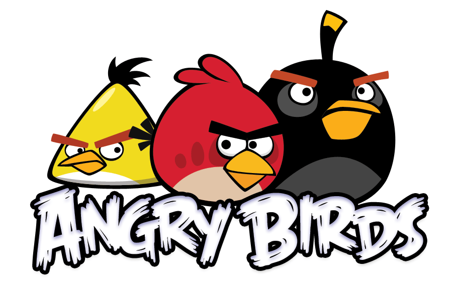

# Angry Birds

## Spil vores Angry Birds

### Spil i Processing
1. Du skal have Processing version `3.5.4` eller ældre installeret på din computer. [Download her](https://processing.org/download/)
1. Download `ZIP` filen fra den seneste udgivelse / release. [Find dem her](https://github.com/orc13a/Angry-Birds/releases)
1. Udpak den downloadede `ZIP` fil.
1. Naviger til mappem `Angry_Birds` og åben filen `Angry_Birds.pde`.
1. Start spillet ved at klikke på `▶️`, oppe i venstre hjørne. Eller brug genvejen `ctrl + r` på Windows og `command + r` på Mac.

### Spil i din browser
Gå til vores GitHub page og der kan du spille vores Angry Birds i din browser.
[Spil her](https://orc13a.github.io/Angry-Birds/)

## SO3
Dette er et SO3 projekt på HTX H. C. Ørsted Gymnasiet Lyngby.
Et projekt som har fokus på matematiske modeller inde for fysik emnet "Det skrå kast".
Fag som er i dette projekt. Fysik `(pi)`, Matematik `(mmhe)`, Programmering `(ajrp)` og Kommunikation og IT `(ae)`.

###### Gruppe
* **Fremlæggelse gruppe** 
Oliver C 
Gustav 
Vittorio 
Valdemar 

* **Programmerings gruppe** 
Oliver C 
Mads
 
2.i Kerm/it 
H.C.Ørsted Gymnasiet Lyngby